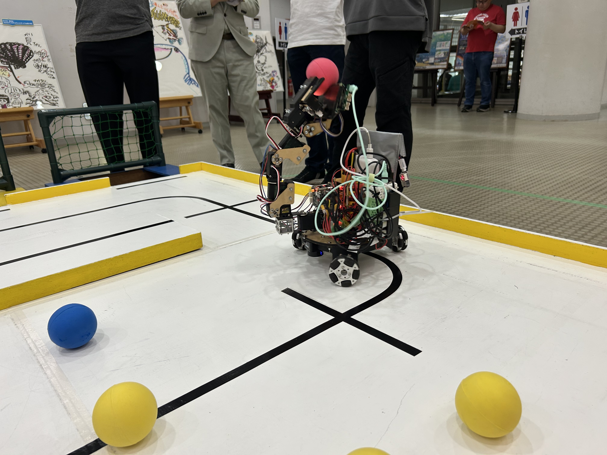
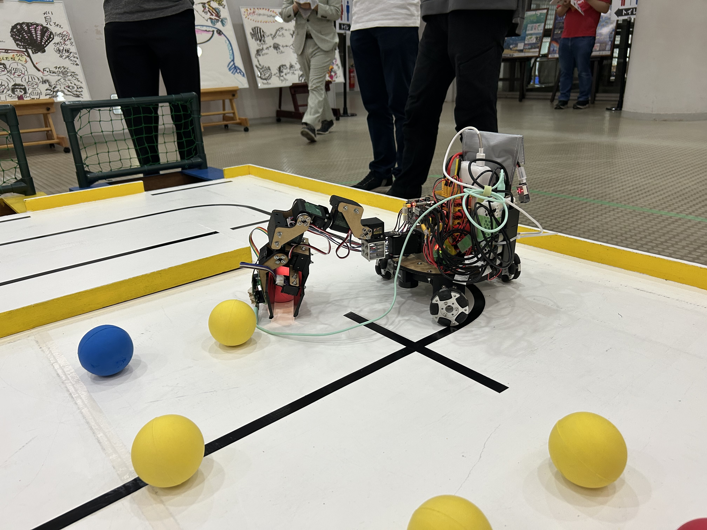

# inrof2026_koma

# ロボット
知能ロボコン2026に出場しました．




# 環境構築
```bash
cd
git clone git@github.com:T-semi-Tohoku-Uni/inrof2026_koma.git
cd inrof2026_koma
```

必要なライブラリのダウンロード
```bash
sudo apt update
sudo apt install -y \
  clang-format \
  ros-humble-ament-cmake-clang-format \
  ros-humble-ament-clang-format
```

commitメッセージのフォーマット設定
```bash
chmod a+x .githooks/*
git config --local core.hooksPath .githooks
```

```bash
sudo apt-get install python3-rosdep
sudo rosdep init
rosdep update
rosdep install --from-paths src -y --ignore-src
```

## プログラムのフォーマット設定
```bash
find ./src \( -path './src/*/include/*.hpp' -o -path './src/*/src/*.cpp' \) $(git submodule status | awk '{print "! -path ./" $2 "/*"}') -print0 | xargs -0 ament_clang_format
```
## libtorchのダウンロード
x86環境の場合
```bash
cd inrof2026_koma/src/komarm
wget https://download.pytorch.org/libtorch/cpu/libtorch-cxx11-abi-shared-with-deps-2.7.0%2Bcpu.zip
unzip libtorch-cxx11-abi-shared-with-deps-2.7.0+cpu.zip
rm -rf libtorch-cxx11-abi-shared-with-deps-2.7.0%2Bcpu.zip
```
aarch64環境の場合（ラズパイなど）
https://github.com/T-semi-Tohoku-Uni/libtorch_aarch64/releases/tag/torchから，ビルド済みのバイナリをダウンロードし，`inrof2026_koma/src/komarm`に配置
```bash
unzip lib.linux-aarch64-cpython-310.zip
rm -rf lib.linux-aarch64-cpython-310.zip
```

# 実行
## ビルド
```
colcon build --symlink-install
```
## シミュレーションの実行
```bash
source install/setup.zsh
ros2 launch inrof2026_koma simulation.launch.py
```

## 実機での実行
```bash
source install/setup.zsh
ros2 launch inrof2026_koma real.launch.py
```

## 別端末でrvizのみ表示したい場合
```
colcon build --symlink-install --packages-select visualizer
source install/setup.zsh
ros2 launch visualizer rviz.launch.py
```

## macbookでrvizだけ表示
docker環境でビルドして，pixiでrvizを立ち上げる．
cloneしたディレクトリにいることを想定
dockerのサーバをビルドして立ち上げる
```bash
docker build --platform linux/amd64 -t inrof2026_koma:latest -f docker/Dockerfile docker
docker run -d --name "inrof2026_koma" -v ".:/work/inrof2026_koma" -w /work/inrof2026_koma "inrof2026_koma:latest" tail -f /dev/null
```
libtorchとrosdepの環境を整える
```bash
docker exec inrof2026_koma bash -lc "
  set -e
  apt-get update
  apt-get install -y --no-install-recommends wget unzip libopenblas-dev
  cd /work/inrof2026_koma/src/komarm
  wget -O /tmp/libtorch.zip 'https://download.pytorch.org/libtorch/cpu/libtorch-cxx11-abi-shared-with-deps-2.7.0%2Bcpu.zip'
  rm -rf libtorch
  unzip /tmp/libtorch.zip
  rm -f /tmp/libtorch.zip
"
```
```bash
docker exec inrof2026_koma bash -lc "
  set -e
  source /opt/ros/humble/setup.bash
  apt-get update
  rosdep update
  rosdep install --from-paths src --ignore-src -r -y
"
```

colon buildする
```bash
docker exec inrof2026_koma bash -lc "
  set -e
  source /opt/ros/humble/setup.bash
  colcon build
"
```

dockerを抜けて，pixiで実行
```bash
pixi install
pixi shell
source install/setup.zsh
ros2 launch visualizer rviz.launch.py
```